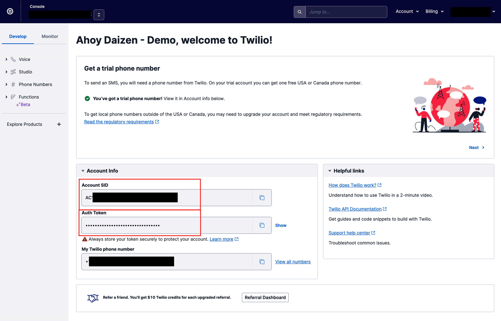
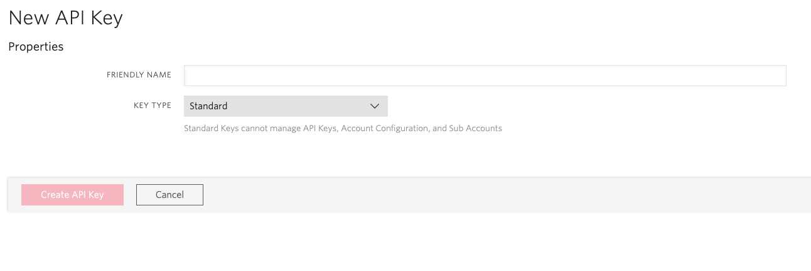
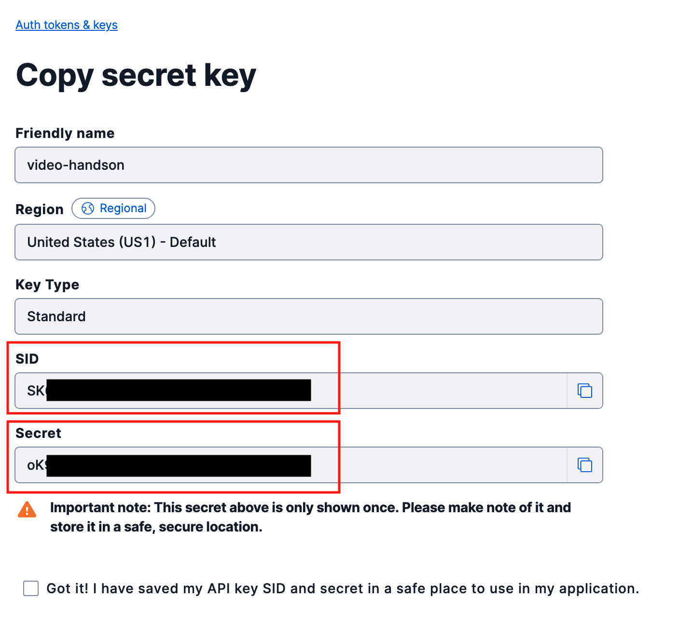

# 手順1: Twilioコンソールにアクセスし、Account Sidの確認とAPIキーの生成を行う

この手順ではTwilioのサービスを利用するために必要な資格情報の確認方法とAPIキー/API Secretの生成方法を体験します。

Programmable Videoを利用するためには、次の3つの資格情報が必要です。

- Account SID
- API Key SID
- API Secret

また、Twilio Nodeヘルパーを利用する場合、下記の情報も必要です。

- Auth Token

## 1-1. Twilioアカウント情報を確認

Twilioが提供するサービスの多くはアカウント情報（`Account SID`, `Auth Token`）を利用し認証します。これらの情報はコンソールから確認できます。

まず、[Twilioホームページ](https://www.twilio.com/ja/)をブラウザーで開き、[LOG IN](https://jp.twilio.com/login) をクリックするか、[コンソール](https://jp.twilio.com/console)に直接移動します。

この画面に表示されている`ACCOUNT SID`、`AUTH TOKEN`を控えます。

## 1-2. APIキーの生成

続いてAPIキーを作成します。[APIキー作成画面](https://jp.twilio.com/console/project/api-keys/create)を表示します。

`FRIENDLY NAME`に作成する任意の名前を入力し、`KEY TYPE`を`Standard`と設定します。

`Create API Key`ボタンをクリックするとキーが作成され、`SID`並びに`SECRET`が表示されます。両方の値を控えてください。

なお、`SECRET`はこの画面のみ、一度しか表示されません。忘れてしまった場合はキーを削除する必要があるためご注意ください。

## 次のハンズオン

- [ハンズオン: アクセストークンの生成](../02-Generate-Access-Token/00-Overview.md)