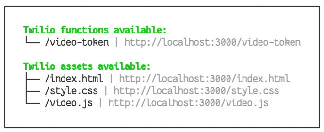
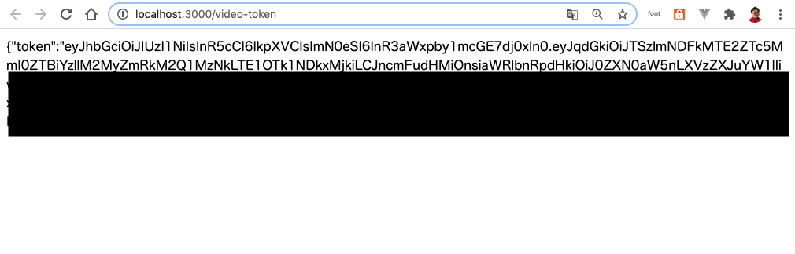
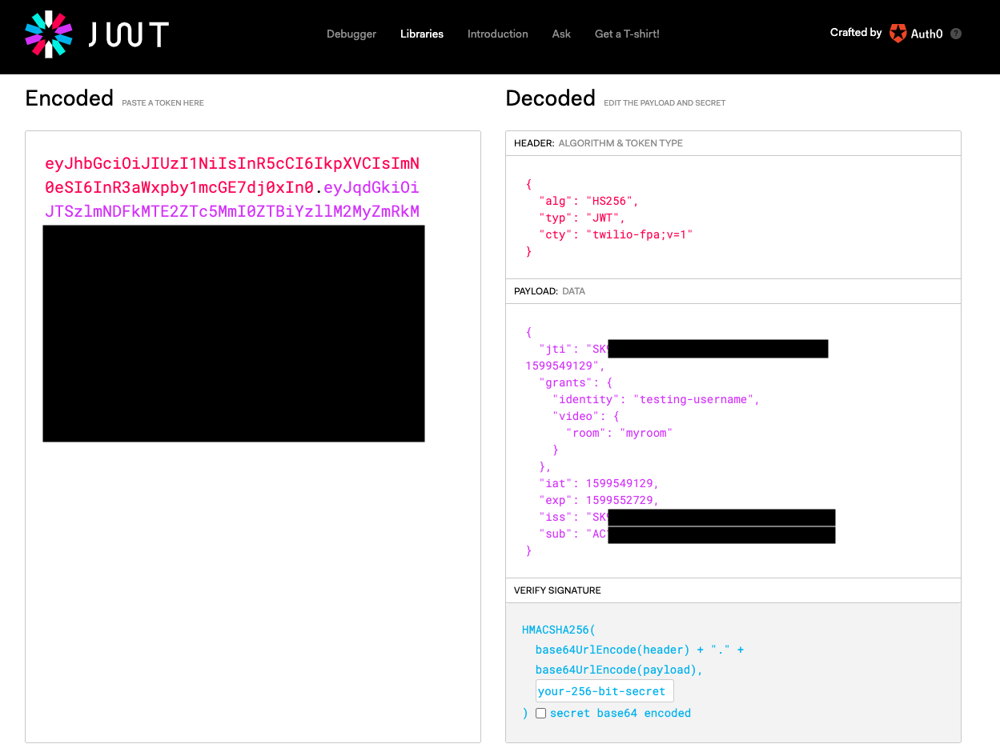
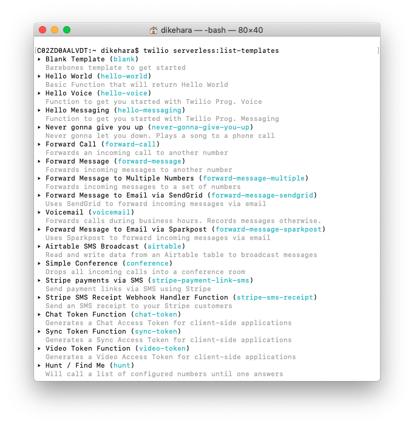

# 手順1: Twilio Serverlessプロジェクトを作成

この手順ではTwilio CLIおよびServerless Toolkitを用いてTwilio Serverlessプロジェクトを作成します。

Twilio CLIおよびServerless Toolkitをインストールしていない場合はこの手順に先立ってインストールしてください。

- [ハンズオン: Twilio CLIをインストール](https://neri78.github.io/Twilio-HandsOn-CLI-JP/docs/01-Install-Twilio-CLI/00-Overview.html)
- [ハンズオン: Twilio CLIを使ったサーバーレス実行環境の構築 - 手順1: Serverless Toolkitのインストール](https://neri78.github.io/Twilio-HandsOn-CLI-JP/docs/03-Use-Serverless-Toolkit/01-Install-Serverless-Toolkit.html)

## 1-1. Twilio Serverlessプロジェクトをテンプレートから作成

Serverless ToolkitはTwilio Functions、Assetsなどのサーバレス実行環境に対応するプロジェクトの開発やデプロイを支援するツールです。このツールを利用してTwilioを利用したアプリケーションをサーバレスで構築できます。

この手順ではビデオ機能をクライアント（Web/iOS/Android）から利用するためのアクセストークン機能が実装されている`video-token`テンプレートを利用します。任意のプロジェクト名をつけて次のコマンドを実行してください。

```bash
twilio serverless:init <アプリ名> --template=video-token
```

`アプリケーション名`のフォルダに移動し、作成されている .envファイルをコードエディタで開きます。最初の2行にはあらかじめ値が入力されていますが、[ハンズオン: AccountSidの確認とAPIキーの作成](../01-Get-Credentials/00-Overview.md)で確認、生成した値に変更します。また、下記の`API_KEY`、`API_SECRET`にも値を入力します。

```
# Variables for function ".env"
# ---
# Your Account Sid (ここは入力しない)
# ACCOUNT_SID=
# API key for your Twilio Account
API_KEY=コンソールで作成した値（SID）
# API secret for your API Key
API_SECRET=コンソールで生成した値
```

## 1-2. テスト実行

トークン生成に必要なロジックはすでに実装されています。プロジェクトフォルダで次のコマンドを実行しローカル環境でアプリケーションを実行します。

```
npm start
```

ターミナル画面に次のような出力が表示されることを確認します。



表示されたURLをブラウザーで開き、アクセストークンが画面に表示されることを確認します。



このアクセストークンにどのような内容が含まれているか確認してみましょう。[jwt.io](https://jwt.io)を開き、生成されたトークンを`Debugger`に貼り付けると`Header`、`Payload`、`Verified Signature`それぞれの情報を確認できます。




## 補足: Severless Toolkitを使ったプロジェクトの作成について

新しくTwilio Serverlessプロジェクトを作成する場合、次のコマンドを実行します。

```bash
twilio serverless:init <アプリ名>
```

Serverless Toolkitにはテンプレートが用意されており、次のコマンドで一覧を確認できます。

```bash
twilio serverless:list-templates
```



## 次の手順

- [Twilio Functionsのカスタマイズ](02-Customize-Function.md)