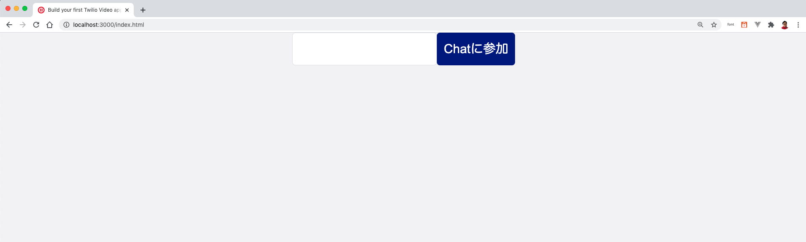

# 手順1: クライアントアプリケーションとSDKの導入

この手順ではRoomに接続するクライアントアプリケーションを作成します。

## 1-1. Assetsにクライアントアプリケーションを配置し、Twilio Video Client SDKを読み込み

`assets`フォルダに配置したファイルは[Assets](https://jp.twilio.com/docs/runtime/assets)にアップロードされます。Assetsは静的なファイルをホスティングであり、`.mp3`のような音声ファイルやテキストファイル、あるいは今回のように`.html`ファイルなどを配置し利用できます。

次のファイルをそれぞれassets内に作成し配置します。
- index.html [[ソース]](../assets/client/index.html)
- video.js [[ソース]](../assets/client/video.js)
- style.css [[ソース]](../assets/client/style.css)

アプリケーションを再起動し、`https://localhost:3000/index.html`にアクセスすると下記のようなページが表示されることを確認します。



続いて`index.html`をコードエディタで開き、コメントアウトされている `<script>`タグをアンコメントします。

```html
<html>
    <!-- 省略 -->
    
    <!-- Twilio Client SDKを読み込み -->
    <script src="//media.twiliocdn.com/sdk/js/video/releases/2.7.2/twilio-video.min.js"></script>
    <script src="./video.js"></script>
 </html>
```

これで`Twilio Video Client SDK`が利用できます。


## 次の手順

- [ルームに接続](02-Connect-To-Room.md)