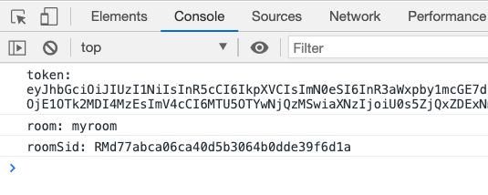
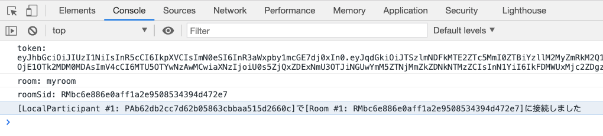

# 手順2: Roomに接続

この手順では`Twilio Video Javascript`を用いてビデオチャット（ミーティング）が行われるRoomに接続します。

## 1-1. アクセストークンの取得を確認

アプリケーションを実行した状態で`index.html`を開き開発者ツールを表示します。テキストボックスにユーザー名を入力し、`Chatに参加`ボタンをクリックしてください。

ここまでのハンズオンを正しく完了していれば開発者ツールのコンソールで次のような出力を確認できます。



実際の処理は`video.js`で確認できます。特に追加の作業はありませんがコードを確認しておくと良いでしょう。

```js
loginForm.addEventListener('submit', async (event) => {
    event.preventDefault();
    // ユーザー名を取得
    const identity = identityField.value;

    // アクセストークンをリクエスト
    let response = await fetch('/video-token', {
        method: 'POST',
        headers: {
            'Content-Type' : 'application/json'
        },
        body: JSON.stringify({ user: identity })
    });
    let {token, room, roomSid} = await response.json();

    // デバッグ用に出力
    console.log(`token: ${token}`);
    console.log(`room: ${room}`);
    
    // ビデオチャットを開始
    startVideoChat(token, room);
});
```

## 1-2 ビデオチャットを開始

上記のロジックの最後で呼び出されている`startVideoChat`関数がビデオチャットへの参加を管理します。この関数は現状空のままになっており、先ほどリクエストしたトークンとRoom名を受け取ります。

```js
async function startVideoChat(token, room) {
    // Video Client SDKを使用し、Roomに接続（音声OFF, ビデオON）
    
    // ローカル参加者をページに追加

    // 現在のルーム参加者をページに追加
    
    // Roomに新たに参加者が追加された場合のイベントハンドラを指定
    
    // Roomから参加者が退出した場合のイベントハンドラを指定
    
    // ブラウザのリロードやタブのクローズ時にRoomから退出

}
```

この関数内に下記のコードを追加し、Twilio Video Client SDKを用いてビデオチャットに参加します。

```js
async function startVideoChat(token, room) {
    // Video Client SDKを使用し、Roomに接続（音声OFF, ビデオON）
    let videoRoom = await Twilio.Video.connect(
       token, {
        room: room,
        audio: false,
        video: true
    });
    // デバッグ用に出力
    console.log(`${videoRoom.localParticipant}で${videoRoom}に接続しました`);

    // ...省略
}
```

ブラウザーのキャッシュをクリアし、再度`index.html`を開き開発者ツールを表示します。その後、テキストボックスにユーザー名を入力し`Chatに参加`ボタンをクリックしてください。初回のみデバイスの使用許可を求められます。

ブラウザコンソールの出力でRoomに参加できていることを確認します。



続けて別ブラウザー、あるいは別タブでユーザー名を変更し参加すると、部屋の種類によってコンソールにエラーが出力されます。たとえば`go`ルームは最大2名となるため、3タブ以上で参加しようとするとエラーになります。

__おめでとうございます。これでビデオチャットを開始できました。__
ただし現時点では参加者の映像が出力されません。次のハンズオンでは映像や音声をほかの参加者と共有する方法を学習します。

## 次のセクション

- [トラックのパブリッシュとサブスクライブ](../05-Publish-Subscribe-Tracks/00-Overview.md)
