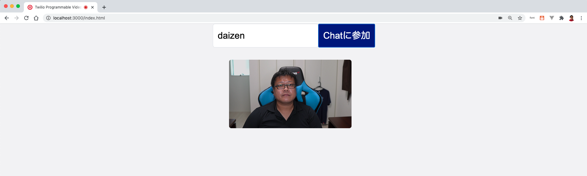

# 手順1: ローカル参加者をページに追加

この手順ではローカル参加者（自分自身）をページに追加し、映像プレビューを表示させます。今回のハンズオンでは細かな実装は行いませんがどのようなフローで処理が走っているかを順を追って確認します。

## 1-1. ローカル参加者をページに追加

`video.js`をコードエディタで開き、`startVideoChat`関数のブロックまでスクロールします。これまでのハンズオンを完了していれば次のブロックとなっています。

```js
async function startVideoChat(token, room) {
    // Video Client SDKを使用し、Roomに接続（音声OFF, ビデオON）
    let videoRoom = await Twilio.Video.connect(
    token, {
        room: room,
        audio: false,
        video: true
    });
    // デバッグ用に出力
    console.log(`${videoRoom.localParticipant}で${videoRoom}に接続しました`);

    // ローカル参加者をページに追加

    // 現在のルーム参加者をページに追加
    
    // Roomに新たに参加者が追加された場合のイベントハンドラを指定
    
    // Roomから参加者が退出した場合のイベントハンドラを指定
    
    // ブラウザのリロードやタブのクローズ時にRoomから退出

}
```

`videoRoom.localParticipant`はローカル参加者、つまり自分自身を表します。
次のコードで自分自身のトラック（映像、音声）をページに追加します。

```js
async function startVideoChat(token, room) {
    // Video Client SDKを使用し、Roomに接続（音声OFF, ビデオON）
    let videoRoom = await Twilio.Video.connect(
    token, {
        room: room,
        audio: false,
        video: true
    });
    // デバッグ用に出力
    console.log(`${videoRoom.localParticipant}で${videoRoom}に接続しました`);

    // ローカル参加者をページに追加
    participantConnected(videoRoom.localParticipant);

    // 現在のルーム参加者をページに追加

    // Roomに新たに参加者が追加された場合のイベントハンドラを指定
    
    // Roomから参加者が退出した場合のイベントハンドラを指定
    
    // ブラウザのリロードやタブのクローズ時にRoomから退出

}
```

この状態で再度ブラウザキャッシュをクリアし、ビデオチャットに参加すると自分自身の映像が表示されます。

```
https://localhost:3000/index.html
```




## 補足:パブリッシュ、サブスクライブ処理について

この項目はコードの解説です。

`participantConnect`関数では引数として受け取った参加者（`participant`）からユーザー名（`identity`）を取得し、ページに表示領域を作成します。

その後、参加者がパブリッシュした各トラックをページに追加します。今回の手順では自分自身がパブリッシュしているトラック（映像）をページに追加しています。

 最後に参加者が新たにトラックをパブリッシュしたトラックをハンドルするイベントハンドラを登録しています。たとえば今回の手順では自分自身が音声トラックをパブリッシュした場合に登録したイベントハンドラが実行されます。

```js
function participantConnected(participant) {
    //  デバッグ用に出力
    console.log(`${participant.identity}がRoomに参加しました。`)
    // <Div>要素を作成。参加者のidentityをIDに設定
    const el = document.createElement('div');
                            participant.identity
    el.setAttribute('id', participant.identity);
    // 参加者一覧に追加
    participants.appendChild(el);


    // 参加者のトラック（映像、音声）をページに追加
    participant.tracks.forEach((trackPublication) => {
        trackPublished(trackPublication, participant);
    })

    // 参加者が新しくパブリッシュした場合のイベントハンドラを登録
    participant.on('trackPublished', trackPublished)
}
```

トラックがパブリッシュされた際の処理の実態は`trackPublished`関数に実装されています。また、トラックがサブスクライブされた際の処理も併せて実装しています。

`trackPublication`にはパブリッシュされたトラックの情報が渡ってきます。このトラックがサブスクライブされているかを判定し、サブスクライブしていれば続けて次の処理を行います。

サブスクライブされた際の処理では`track.attach()`メソッドを使用しています。このメソッドはトラックの種類に合わせて `<video>`, `<audio>` タグが生成されます。これらのタグをページに追加し映像や音声を表示できます。この際、ソースの指定等はすべてTwilio Client SDKで設定しているので必要ありません。

サブスクライブがされていない場合はイベントハンドラを登録します。

```js
// トラックがパブリッシュされた際の処理
function trackPublished(trackPublication, participant) {
    // 事前に作成した参加者のIdentityをIDにした<div>要素を取得
    const el = document.getElementById(participant.identity);

    // トラックがサブスクライブされた際の処理
    const trackSubscribed = (track) => {
    // trackの種類に合わせて<video> <audio>タグを要素に追加
    el.appendChild(track.attach())
    // デバッグ用に出力
    console.log(`${track}のサブスクライブ後処理を完了しました。`)
    };

    // パブリッシュされたトラックがサブスクライブされている場合
    if (trackPublication.track)
        trackSubscribed(trackPublication.track);
    
    // パブリッシュされたトラックのサブスクライブイベントハンドラを登録
    trackPublication.on('subscribed', trackSubscribed);
}
```

## 次の手順

- [Roomへの参加・退出をハンドリング](02-Handle-Join-Leave-Participant.md)